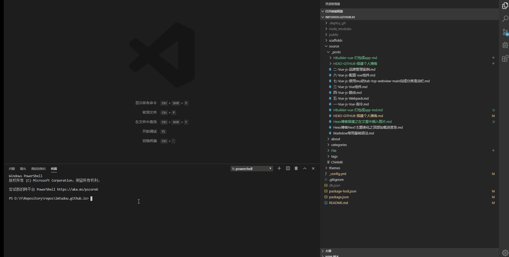

在写文章时，常常有配图说明的需求。

## 本地引用
### 绝对路径

当Hexo项目中只用到少量图片时，可以将图片统一放在source/images文件夹中，通过markdown语法访问它们。

```js
source/images/image.jpg


```
图片既可以在首页内容中访问到，也可以在文章正文中访问到。

### 相对路径
图片除了可以放在统一的`images`文件夹中，还可以放在文章自己的目录中。文章的目录可以通过配置`_config.yml`来生成。
```js
_config.yml

post_asset_folder: true
```

## CDN应用
即网络资源图片


---

我常用采取的方式是：

+ 执行 ```hexo new "Hexo博客搭建之在文章中插入图片.md"```

+ 在 ```/source/_posts/```新建一个名为```Hexo博客搭建之在文章中插入图片```的文件夹将图片放进去

+ 使用markdow语法访问即可``


 


 